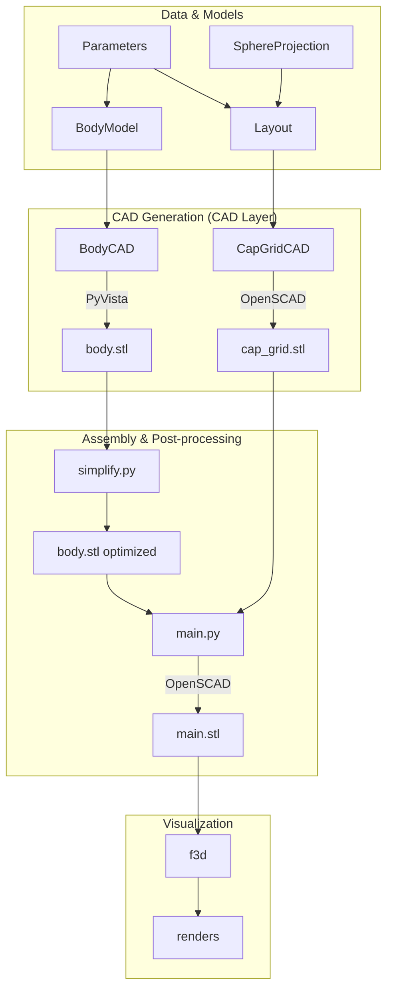

# Manikeys Architecture

Manikeys is a modular, model-driven CAD system for designing
ergonomic keyboards. It combines the power of NumPy/PyVista for
complex surface generation with PythonSCAD for final assembly and
CSG operations.

## High-Level Overview

The system follows a pipeline where data models drive the generation
of individual geometry components, which are then simplified and
assembled into the final 3D model.

## Core Components

### 1. Data Models (`src/models/` & `src/data/`)
The "brain" of the project. Everything is parametric.
- **Parameters**: Defines physical constants (cap size, gap, wall
  thickness, fillet radius).
- **Layout**: Calculates the 3D position and rotation of every key.
  It uses **Spherical Projections** to ensure keys are ergonomically
  oriented towards a central point.
- **BodyModel**: A mathematical representation of the keyboard's
  shell. It uses smooth interpolation functions to define the top
  surface $z = f(x, y)$, including complex areas like the thumb
  section.

### 2. CAD Objects (`src/cad/`)
Wrappers around geometry kernels that transform models into 3D
files.
- **`Object[T]`**: An abstract base class providing a common
  interface for `assemble()`, `save()`, and `show()`.
- **`VistaObject` (PyVista)**: Used for the keyboard body. It
  generates a dense mesh of points using NumPy meshgrids, which is
  ideal for smooth, organic surfaces.
- **`OSCObject` (PythonSCAD)**: Used for components that benefit
  from CSG (unions, differences) or for the final assembly.

### 3. Dependency Injection (`src/context.py`)
The project uses the `injector` library to manage dependencies. This
allows CAD classes to receive their required models (like
`BodyModel` or `Layout`) without knowing how they were constructed
or projected.

### 4. Build System (`Makefile`)
The build process is orchestrated by a `Makefile` to handle the multi-tool pipeline:
1.  **Component Generation**: Individual scripts generate STL files
    for the body, keycaps, and grids.
2.  **Mesh Optimization**: Complex meshes (like the body) are
    generated with high resolution and then simplified using
    `meshlib` (`simplify.py`) to reduce file size while maintaining
    detail.
3.  **Final Assembly**: `src/main.py` loads the optimized STL
    components and performs the final boolean operations (e.g.,
    subtracting keycap holes from the body).

## Design Decisions

- **Hybrid Geometry Kernel**: Using PyVista/NumPy for the body
  allows for complex mathematical surfaces that are difficult to
  define in pure CSG. PythonSCAD is then used for what it does best:
  assembling parts and final boolean operations.
- **Parametric Everything**: By decoupling the projection logic
  (`src/models/projection.py`) from the layout, the keyboard can be
  easily adjusted for different hand sizes or ergonomic preferences
  by changing a few parameters.
- **Off-screen Assembly**: The final assembly (`main.py`) loads STLs
  generated in previous steps. This speeds up the build process by
  allowing parallel generation of components and avoids
  re-calculating complex body surfaces during final assembly.

## Technology Stack

- **PythonSCAD**: The primary engine for OpenSCAD-based 3D
  generation.
- **PyVista / NumPy**: For point-cloud and mesh generation of
  organic surfaces.
- **MeshLib (mrmeshpy)**: For mesh simplification and optimization.
- **F3D**: For high-quality automated rendering of the final model.
- **Injector**: For clean dependency management between data models
  and CAD logic.
